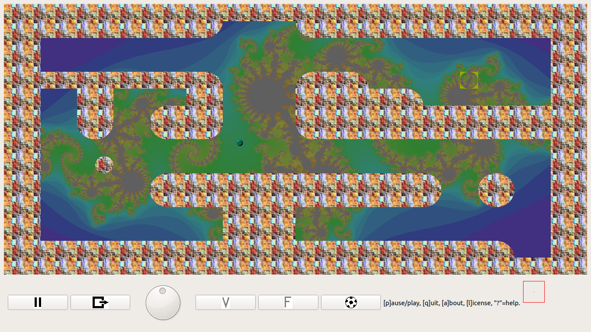

# maze
A maze / flipper game implementation for a Raspberry Pi with Sense Hat

Maze for Raspberry Pi with Sense HAT is a simple game originally
designed for running on the [_Raspberry Pi_ [1]](#cite1) equipped with
the [_Sense HAT_ [2]](#cite2) add-on board.  The ball is controlled by
the Sense HAT's gyroscope and accelerometer sensors.  As a special
algorithmic design feature, the maze labyrinth's walls are shaped with
mathematical specifications based on implicit curves.  Hence, this
project is also a plea for use of implicit curves.



Fig. 1: Playing Field

The algorithmic key feature of this game implementation is the way the
ball's reflection is computed.  Most standard implementations use
segments of straight line as wall, resulting in an angle of reflection
being equal to the angle of incidence.  For computing reflections on
_curved_ lines, one would have to compute the tangent of the curve in
the point where the ball hits the curve.

This game implementation follows a different approach: Walls are
described by shapes of _implicit curves_.

## Implicit Curves

An _implicit curve_ defines — as opposed to an explicit curve as in a
_function_ — a set of points in terms of an equation's set of
solutions.  Implicit curves are relatively seldom used in software,
specifically when written in an imperative language.  Among the few
usages of implicit curves in computer software, there is worth of
mentioning <span style="font-variant: small-caps">D.E.Knuth</span>'s
[_METAFONT_ [3]](#cite3) language, a descriptive language that deploys
implicit curves to describe the shape of font characters.  Similarly,
in vector graphics representation, implicit curves often play a
central role.  One could imagine that implicit curves compare to
explicit curves somewhat like functional programming to imperative
programming: The entities of consideration are expressed in a
descriptive manner rather than in a programmatic manner, that is,
purely in terms of the outcome (“what”) without defining the explicit
order of actions (“how”).

## Implicit Curve Shapes in Maze

This maze game features implicit curves for a very similar purpose.
Drawing the walls on the game's playing field boils down on testing if
a screen pixel is inside the region defined by an implicit curve.  In
fact, it turns out, that even computing a ball's reflection on a
curved wall boils down to considering the normal vector of the curve's
partial derivations and adjusting the direction of the ball's movement
by the difference of the ball's previous direction and the curved
wall's normal vector.  This approach is highly superior compared to
“classic” approaches like computations with sobel operators, which, in
practice, tremendously suffer from pixel aliasing.  In contrast,
implicit curves offer — just like vector graphics — the chance of
resolution only limited by the processor's numerical capabilities.

Implicit curves have the
neat property that the equation of the tangent line at a regular point
(_x_<sub>0</sub>, _y_<sub>0</sub>) is

  _F_<sub>_x_</sub>(_x_<sub>0</sub>,
  _y_<sub>0</sub>)(_x_ − _x_<sub>0</sub>) +
  _F_<sub>_y_</sub>(_x_<sub>0</sub>,
  _y_<sub>0</sub>)(_y_ − _y_<sub>0</sub>) = 0,

such that the slope is

  -_F_<sub>_x_</sub>(_x_<sub>0</sub>, _y_<sub>0</sub>) /
  _F_<sub>_y_</sub>(_x_<sub>0</sub>, _y_<sub>0</sub>).

From the slope, the angle of reflection can be very simply computed
from the angle of incidence by adding twice the difference between the
slope's angle and the angle of incidence to the angle of incidence.

This implementation supports 2nd degree polynomial implicit curves,
and intersection (operator "and") and union (operator "or") and
negation (operator "not") of such curves.  The game field is built by
_tiling_, that is by defining a set of different tiles and then
building the field by any combination of the tiles in the set.  For
each tile, a shape is defined by an implicit curve.  For example, the
following lines

```
  <shape id="full_small_centered_circle">
    <!-- (x-½)² + (y-½)² ≤ ¼ -->
    <implicit-curve>x*x - x + 0.25 + y*y - y + 0.25 - 0.25</implicit-curve>
  </shape>
```

define the shape for a tile that consists of a small filled circle
that is centered within the tile.  Implicit curves are always assumed
to have the form _F_(_x_, _y_)≤0, such that it is sufficient to specify the
left side of the equation.

Other examples:

### Empty Shape

The constant equation 1≤0 is never true for any (_x_, _y_) (since
neither _x_ nor _y_ appears in the equation), such that this shape
will result in an empty tile.

```
  <shape id="empty_tile">
    <!-- 1 ≤ 0 -->
    <implicit-curve>1</implicit-curve>
  </shape>
```

### Solid Shape

The constant equation -1≤0 is always true for any (_x_, _y_) (since
neither _x_ nor _y_ appears in the equation), such that this shape
will result in a solid filled tile.

```
  <shape id="solid_tile">
    <!-- - 1 ≤ 0 -->
    <implicit-curve>-1</implicit-curve>
  </shape>
```

### Shape With Circle in Upper Left Corner

```
  <shape id="circle_in_upper_left_corner">
    <and>
      <!-- (x-1)² + (y-1)² ≤ 1 -->
      <implicit-curve>x*x - 2*x + 1 + y*y - 2*y + 1 - 1</implicit-curve>
      <!-- x + y ≤ 1 -->
      <implicit-curve>x + 2*y - 1</implicit-curve>
    </and>
  </shape>
```

## Background and Foreground Brushes

Effectively, each implicit curve defines for each screen pixel, if it
should be displayed as foreground (when _F_(_x_, _y_)≤0) or otherwise
as background (when _F_(_x_, _y_)>0).

For painting foreground and background, brushes can be defined.  As a
special feature, besides solid brushes and brushes based on image art
work, this game implementation also supports fractals as brushes by
specifying a region of either the Mandelbrot or the Julia set, for
example:

```
  <brush id="background_mandelbrot_1">
    <fractal>
      <mandelbrot />
      <max-iterations>256</max-iterations>
      <x-offset>-1.360</x-offset>
      <y-offset>-0.095</y-offset>
      <x-scale>+0.06125</x-scale>
      <y-scale>+0.06125</y-scale>
    </fractal>
  </brush>
```

or

```
  <brush id="background_julia_1">
    <fractal>
      <julia>
        <arg-n>7</arg-n>
        <arg-c>
          <real>+0.626</real>
          <imag>+0.0</imag>
        </arg-c>
      </julia>
      <max-iterations>4096</max-iterations>
      <x-offset>-3.0</x-offset>
      <y-offset>-3.0</y-offset>
      <x-scale>+6.0</x-scale>
      <y-scale>+6.0</y-scale>
    </fractal>
  </brush>
```
## Tiles

Tiles are defined by referring to a shape and optionally overriding
default foreground and / or background brushes, for example:

```
  <tile id="hole">
    <foreground>
      <brush>
        <solid>#99AA00</solid>
      </brush>
    </foreground>
    <shape ref="full_small_centered_hole" />
  </tile>
```

## Game Field

Finally, the game field is composed of a rectangular set of tiles.
Tiles may be referred to either by their full name, or by a shortcut,
such that the full field may be visualized as ASCII art for easier
editing.  The field specification also contains the initial ball
position(s) and velocity(ies) and mass(es).  Example:

```
  <field>
    <ignore>&#x09;</ignore>
    <ignore>&#x0a;</ignore>
    <ignore>&#x0d;</ignore>
    <ignore>&#x20;</ignore>
    <tile-shortcut id="╭" ref="wall-rounded-upper-left" />
    <tile-shortcut id="╰" ref="wall-rounded-lower-left" />
    <tile-shortcut id="╮" ref="wall-rounded-upper-right" />
    <tile-shortcut id="╯" ref="wall-rounded-lower-right" />
    <tile-shortcut id="┼" ref="wall-solid" />
    <tile-shortcut id="╳" ref="corridor" />
    <tile-shortcut id="o" ref="circle" />
    <tile-shortcut id="0" ref="hole" />
    <columns>32</columns>
    <rows>16</rows>
    <contents>
      ┼┼┼┼┼┼┼┼┼┼┼┼┼┼┼┼┼┼┼┼┼┼┼┼┼┼┼┼┼┼┼┼
      ┼┼┼┼┼┼┼┼┼┼┼╯╳╳╳╳╰┼┼┼┼┼┼┼┼┼┼┼┼┼┼┼
      ┼┼╳╳╳╳╳╳╳╳╳╳╳╳╳╳╳╳╳╳╳╳╳╳╳╳╳╳╳╳┼┼
      ┼┼╳╳╳╳╳╳╳╳╳╳╳╳╳╳╳╳╳╳╳╳╳╳╳╳╳╳╳╳┼┼
      ┼┼┼┼┼┼┼┼┼┼┼╮╳╳╳╳╭┼┼╮╳╳╳╳╳0╳╳╳╳┼┼
      ┼┼╳╳┼┼╳╳╳╳┼┼╳╳╳╳┼┼┼┼┼┼╮╳╳╳╳╳╳╳┼┼
      ┼┼╳╳┼┼╳╳╭┼┼┼╳╳╳╳┼┼┼┼┼┼┼┼┼┼┼┼┼┼┼┼
      ┼┼╳╳╰╯╳╳╰┼┼╯╳╳╳╳╰┼┼┼┼┼┼┼┼┼┼┼┼┼┼┼
      ┼┼╳╳╳╳╳╳╳╳╳╳╳╳╳╳╳╳╳╳╳╳╳╳╳╳╳╳╳╳┼┼
      ┼┼╳╳╳o╳╳╳╳╳╳╳╳╳╳╳╳╳╳╳╳╳╳╳╳╳╳╳╳┼┼
      ┼┼╳╳╳╳╳╳╭┼┼┼┼┼┼┼┼┼┼┼┼┼┼╮╳╳╭╮╳╳┼┼
      ┼┼╳╳╳╳╳╳╰┼┼┼┼┼┼┼┼┼┼┼┼┼┼╯╳╳╰╯╳╳┼┼
      ┼┼╳╳╳╳╳╳╳╳╳╳┼┼┼┼╳╳╳╳╳╳╳╳╳╳╳╳╳╳┼┼
      ┼┼╳╳╳╳╳╳╳╳╳╳┼┼┼┼╳╳╳╳╳╳╳╳╳╳╳╳╳╳┼┼
      ┼┼┼┼┼┼┼┼┼┼┼┼┼┼┼┼┼┼┼┼┼┼┼┼┼┼┼╮╳╳┼┼
      ┼┼┼┼┼┼┼┼┼┼┼┼┼┼┼┼┼┼┼┼┼┼┼┼┼┼┼┼┼┼┼┼
    </contents>
    <ball>
      <position>
        <row>4</row>
        <column>12</column>
      </position>
      <velocity>
        <x>0.000020</x>
        <y>0.000011</y>
      </velocity>
      <mass>1.0</mass>
    </ball>
  </field>
```

Tile shortcuts are specified within the ``field`` elment rather on the
``tile`` element, since you may want the same tile to appear with a
different shortcut for each field definition.  (Currently, only one
field can be defined, but as soon as the game will support multiple
levels, there will also be multiple field definitions).

## Current Implementation Status of Reflection Computation

The computation of ball reflections already works fine on the level of
tiles for any 2nd degree polynomial implicit curve.

However, consider the special case of a solid tile.  When a ball hits
such a tile excatly on one of its corner points with a degree of 45°,
the reflection will be equal to the arithmetic means of the
reflections of either adjacent side of that corner.  This is fine for
an isolated tile.  However, if there is a row of multiple adjacent
solid tiles, they together form a straight line segment as wall, but
when the ball again hits a corner pixel of one of these tiles,
building the arithmetic means of adjacent side reflections will still
occur, resulting in the ball being reflected with an improper
reflection angle.

There is an obvious solution to this problem: When calculating the
angle of reflection, tiles may not be considered separately, but also
adjacent tiles must be taken into consideration.  More precisely, for
each pixel on the border of a tile (and, in particular, for each pixel
in one of the four corners of a tile), the shape of the neighbouring
tile must be taken into account.  This requirement can be easily
implemented by combining the two adjacent shapes just like the "and"
operator, that is already implemented for specifying shapes.  I have
not yet implemented this solution, but it should be doable in a
straight forward manner, as soon as I will have time to continue this
implementation of a maze / flipper game.

## Coding Philosophy

For most projects — especially when it comes to complex data
structures as well as graphics — I prefer a modern, high-level
language like Java.  However, for implementing this maze game, I
finally chose C++ as core language with Qt5 as GUI toolkit for mainly
three reasons:

* The software needs to access the Sense HAT's hardware.  While there
is a [_Python_ [4]](#cite4) library available especially for this
purpose, I did not want to rely on an interpreted script language for
the whole software just because of that single library.

* Parts of the software are somewhat performance critical.  While, as
of today, Java offers a performance approximating that of lower level
languages like C++, the latter still gives me more control e.g. over
data layout, volatility of data, and the time of freeing memory.

* In C++, I use Qt5 as GUI toolkit, which I expect to more smoothly
integrate with the underlaying hardware.  I suspect it to eventually
provide better performance especially when it comes to graphics
hardware acceleration features (though I may be wrong with this
assumption).

## History

Almost simultaneously with the launch of the Raspberry Pi Sense HAT, a
tiny [_Marble Maze_ [5]](#cite5) game was published in order to
demonstrate the new Sense HAT's capabilities.  While this Python based
program consists of just 55 LOC (counting without empty lines), it is
very primitive.  In particular, it

* considers data from the gyroscope and acceleration sensors as
binary, i.e. it does not consider gradations of velocity,

* consequently supports only 8 different ball movements (horizontal,
vertical and diagonal),

* does not consider ball reflections when hitting a wall,

* simply uses the Sense HAT's 8×8 LED matrix as graphics display, and

* uses a single, hard-coded labyrinth as playing field.

While this little demonstration program deploys basic functionality of
many of the Sense HAT's sensors, I thought it would be nice to get
even more out of the sensors and implement a more elaborated version
of a maze game.  My effort resulted in the implementation provided
with this repository.

## References

1. <a id="cite1" /><span style="font-variant: small-caps">Raspberry Pi
   Foundation:</span> _Raspberry Pi — Teach, Learn, and Make with
   Raspberry Pi._
   [https://www.raspberrypi.org/](https://www.raspberrypi.org/")

2. <a id="cite2" /><span style="font-variant: small-caps">Raspberry Pi
   Foundation:</span> _Sense HAT — Raspberry Pi._
   [https://www.raspberrypi.org/products/sense-hat/](https://www.raspberrypi.org/products/sense-hat/)

3. <a id="cite3" /><span style="font-variant:
   small-caps">D.E.Knuth:</span> _Metafont: The Program._
   Addison-Wesley.

4. <a id="cite4" /><span style="font-variant: small-caps">Python
   Software Foundation:</span> _Welcome to Python.org._
   [https://www.python.org/](https://www.python.org/)

5. <a id="cite5" /><span style="font-variant: small-caps">Raspberry Pi
   Foundation:</span> _Sense HAT Marble Maze._
   [https://projects.raspberrypi.org/en/projects/sense-hat-marble-maze](https://projects.raspberrypi.org/en/projects/sense-hat-marble-maze)
